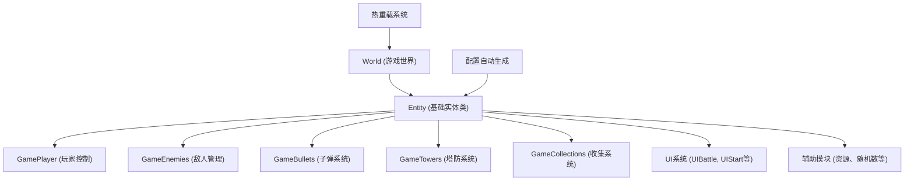

# FightForC

> 🎮 **FightForC** 是一款基于 Unity 的四分之一视角 3D 动作游戏，融合了射击、塔防与收集要素，采用模块化架构设计，支持热重载开发。

---

## ✨ 项目特色

- **🎯 四分之一视角 3D 动作体验**：经典视角的现代化实现
- **⚔️ 智能战斗系统**：自动瞄准最近敌人，流畅的射击体验
- **🤖 多样化敌人系统**：独特的AI行为与属性配置
- **💰 收集与经济系统**：金币收集影响游戏进程
- **🏰 塔防策略元素**：可建造防御塔的战略玩法
- **🔧 模块化架构**：基于自定义ECS系统，易于维护与扩展
- **📊 数据驱动配置**：JSON配置自动生成C#类，支持技能系统
- **🛠️ 自定义编辑器工具**：提升开发效率的Unity编辑器扩展
- **🎮 现代输入系统**：基于Unity新输入系统的响应式控制
- **🔥 热重载支持**：支持运行时代码更新，加速开发迭代

---

## 🏗️ 架构概览



### 核心架构特点
- **自定义ECS架构**：基于Entity基类的组件化设计
- **模块化游戏逻辑**：每个游戏功能独立为一个Game模块
- **事件驱动通信**：通过Events枚举实现模块间解耦通信
- **配置驱动开发**：JSON配置自动生成C#配置类
- **热重载支持**：通过CodeLoader实现运行时代码更新
- **UI系统分离**：独立的UI管理，支持Facade模式

---

## 🚀 快速开始

### 环境要求
- **Unity版本**：Unity 6000.2.0b7 或更高版本
- **平台支持**：Windows, macOS, Linux
- **.NET版本**：支持.NET Standard 2.1

### 安装步骤
1. **克隆仓库**
   ```bash
   git clone <你的仓库地址>
   cd FightForC
   ```

2. **打开Unity项目**
   - 使用Unity Hub打开项目文件夹
   - Unity会自动解析依赖包

3. **运行游戏**
   - 打开主场景：`Assets/Scenes/Main.unity`
   - 点击Play按钮开始游戏

### 控制说明
- **移动**：WASD键或方向键
- **射击**：自动瞄准最近敌人
- **暂停**：ESC键

---

## ⚙️ 项目结构

### 核心目录说明
```
FightForC/
├── Assets/                          # Unity资源文件
│   ├── Scenes/Main.unity           # 主游戏场景
│   ├── Resources/                  # 运行时加载资源
│   ├── Editor/                     # 编辑器扩展工具
│   ├── QuarterView 3D Action BE5/  # 3D角色资源包
│   └── skills_data.json           # 技能配置数据
├── Codes/                          # 游戏逻辑代码
│   ├── Game/                       # 核心游戏模块
│   │   ├── GamePlayer.cs          # 玩家控制逻辑
│   │   ├── GameEnemies.cs         # 敌人管理系统
│   │   ├── GameBullets.cs         # 子弹系统
│   │   └── GameTowers.cs          # 塔防系统
│   ├── UI/                         # 用户界面
│   ├── Helpers/                    # 辅助工具类
│   ├── ConfigAuto/                 # 自动生成配置
│   └── World/                      # 游戏世界管理
└── ProjectSettings/                # Unity项目设置
```

### 配置系统
- **技能配置**：`Assets/skills_data.json` - 定义技能效果和触发时机
- **自动生成配置**：`Codes/ConfigAuto/Configs/` - 由编辑器工具自动生成的C#配置类
- **编辑器工具**：`Assets/Editor/ConfigAuto/` - 配置自动生成和管理工具

### 关键系统
- **事件系统**：通过`Events`枚举实现模块间通信
- **实体系统**：基于`Entity`基类的组件化架构
- **资源管理**：通过`ResourceHelper`统一管理资源加载
- **UI管理**：支持Facade模式的UI系统

---

## 🤝 贡献指南

欢迎提交 Issue 或 Pull Request！
1. Fork 本仓库
2. 新建分支进行开发
3. 提交 PR 并描述你的更改

---

## 📄 许可证

本项目基于 MIT 许可证，详见 `LICENSE` 文件。

---

## 🙏 致谢

感谢所有为本项目做出贡献的开发者，以及 Unity 社区的支持！

README FILE GENERATED BY GEMINI CLI / CURSOR
