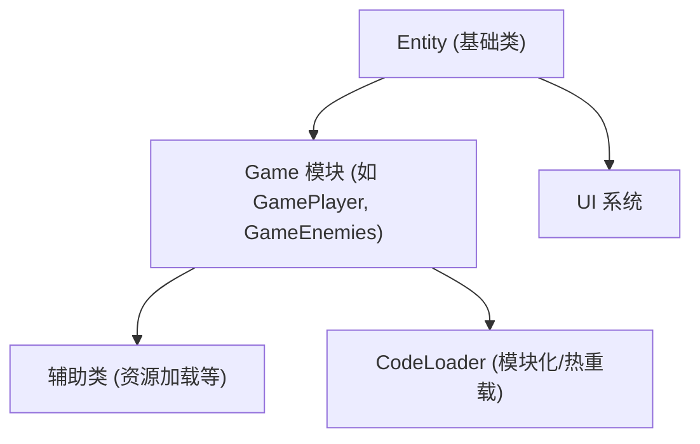

# FightForC

> 🎮 **FightForC** 是一款基于 Unity 的四分之一视角 3D 动作游戏，融合了射击、塔防与收集要素，强调模块化与高效开发。

---

## ✨ 项目亮点

- **四分之一视角 3D 动作体验**
- **动态战斗系统**：玩家射击、子弹机制、敌人互动
- **多样化敌人**：独特行为与属性
- **可收集物品**：金币等影响玩法的道具
- **塔防元素**：战略性防御塔管理
- **模块化架构**：易于维护与扩展
- **数据驱动配置**：自动生成 C# 配置文件
- **自定义 Unity 编辑器工具**：提升开发效率
- **现代输入系统**：基于 Unity 新输入系统

---

## 🏗️ 架构概览



- 基于自定义实体-组件-系统（ECS）架构
- 游戏逻辑分离于 `Game` 模块
- UI 独立管理，辅助类处理资源与工具
- 支持模块化与热重载开发

---

## 🚀 快速开始

1. **克隆仓库**
   ```bash
   git clone <你的仓库地址>
   ```
2. **用 Unity 打开项目**
   - 推荐 Unity 2023.x 或更高版本（详见 `ProjectSettings/ProjectVersion.txt`）
3. **安装依赖包**
   - Unity 会自动解析 `Packages/manifest.json`
4. **启动主场景**
   - 打开 `Assets/Scenes/Main.unity`，点击运行

---

## ⚙️ 配置说明

- 游戏数据（如子弹、怪物属性）定义于：
  - `Codes/ConfigAuto/Configs/Config_Bullet.cs`
  - `Codes/ConfigAuto/Configs/Config_Monster.cs`
- 这些配置由 `Assets/Editor/ConfigAuto` 下的编辑器脚本自动生成和管理。

---

## 🤝 贡献指南

欢迎提交 Issue 或 Pull Request！
1. Fork 本仓库
2. 新建分支进行开发
3. 提交 PR 并描述你的更改

---

## 📄 许可证

本项目基于 MIT 许可证，详见 `LICENSE` 文件。

---

## 🙏 致谢

感谢所有为本项目做出贡献的开发者，以及 Unity 社区的支持！

README FILE GENERATED BY GEMINI CLI / CURSOR
